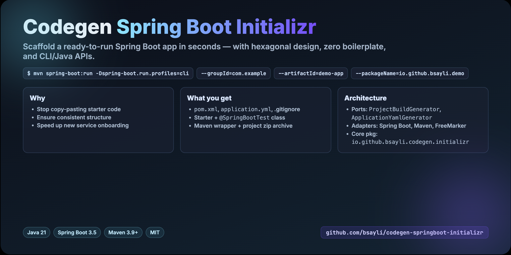

# Codegen Spring Boot Initializr


<p align="center">
  
  <br/>
  <em>Social preview banner for GitHub and sharing</em>
</p>

**A customizable project generator for Spring Boot**.
Quickly scaffold a new Java application with predefined structure, configuration, and tests — no repetitive setup
required.

---

## 🚀 Problem Statement

Bootstrapping a new Spring Boot project often involves:

* Manually creating Maven folders
* Writing boilerplate `pom.xml`
* Copying `.gitignore`, `application.yml`, and test classes
* Setting up wrapper scripts

❌ Time wasted on repetitive setup
❌ Risk of inconsistencies between projects
❌ Slower onboarding for new developers

---

## 💡 Solution

This project automates all of that:

* Generates a **ready-to-run Spring Boot project** with Maven
* Adds **`.gitignore`, `application.yml`, starter class, and test class**
* Supports **custom package and project naming**
* Ships with **CLI runner** for easy one-liner project generation
* Produces a **zip archive** you can immediately extract and use

---

## ⚡ Quick Start

### 1. Clone the Repository

```bash
git clone https://github.com/bsayli/codegen-springboot-initializr.git
cd codegen-springboot-initializr
```

### 2. Build the Project

```bash
mvn clean install
```

### 3. Run in CLI Mode

```bash
mvn spring-boot:run -Dspring-boot.run.profiles=cli \
  -Dspring-boot.run.arguments="--groupId=com.example --artifactId=demo-app --packageName=com.example.demo --outputDir=./target/generated-projects --overwrite=true"
```

✅ This generates a new project as a zip archive under the specified output directory (default:
`./target/generated-projects`):

```
[OK] Project archive generated at: /.../target/generated-projects/demo-app/demo-app.zip
```

ℹ️ Tips:

* If you don’t provide `--outputDir`, the project will be created under the default path `target/generated-projects`
  inside the current working directory.
* If the target directory already exists:

    * By default, the generator will **fail-fast** with a clear error.
    * Add `--overwrite=true` to **delete and regenerate** the project in the same directory.

---

## 🧑‍💻 Programmatic Usage

```java
import java.io.File;
import java.nio.file.Path;
import java.util.List;

import com.c9.codegen.initializr.projectgeneration.model.Dependency;
import com.c9.codegen.initializr.projectgeneration.model.ProjectType;
import com.c9.codegen.initializr.projectgeneration.model.spring.SpringBootJavaProjectMetadata.SpringBootJavaProjectMetadataBuilder;
import com.c9.codegen.initializr.projectgeneration.model.techstack.BuildTool;
import com.c9.codegen.initializr.projectgeneration.model.techstack.Framework;
import com.c9.codegen.initializr.projectgeneration.model.techstack.Language;
import com.c9.codegen.initializr.projectgeneration.service.ProjectGenerationService;

// Assume ProjectGenerationService is injected or obtained from Spring context
ProjectGenerationService service = /* @Autowired or ApplicationContext.getBean(...) */;

var depWeb =
    new Dependency.DependencyBuilder()
        .groupId("org.springframework.boot")
        .artifactId("spring-boot-starter-web")
        .build();

var depTest =
    new Dependency.DependencyBuilder()
        .groupId("org.springframework.boot")
        .artifactId("spring-boot-starter-test")
        .scope("test")
        .build();

var metadata = new SpringBootJavaProjectMetadataBuilder()
        .springBootVersion("3.5.5")
        .javaVersion("21")
        .groupId("com.example")
        .artifactId("demo-app")
        .name("demo-app")
        .description("Generated by codegen-initializr-core")
        .packageName("com.example.demo")
        .dependencies(List.of(depWeb, depTest))
        .build();

var type = new ProjectType(Framework.SPRING_BOOT, BuildTool.MAVEN, Language.JAVA);

Path zip = service.generateProject(type, metadata);
System.out.println("Archive generated at: " + zip.toAbsolutePath());
```

---

## 🖼 Demo Output

Example of the generated project structure:

```text
demo-app/
 ├── pom.xml
 ├── .gitignore
 ├── src/
 │   ├── main/java/com/example/demo/DemoAppApplication.java
 │   ├── main/resources/application.yml
 │   ├── test/java/com/example/demo/DemoAppApplicationTests.java
 │   └── gen/java/... (for codegen output)
```

---

## 🛠 Tech Stack & Features

* 🚀 **Java 21** — modern baseline
* 🍃 **Spring Boot 3.5** — microservice foundation
* 📦 **Maven 3.9+** — build and dependency management
* 🧩 **FreeMarker templates** — for generator extensibility
* 📂 **Automatic directory structure** — `src/main/java`, `src/test/java`, etc.
* 🧪 **JUnit 5** — generated test classes

---

## 🧩 Architecture

This project follows a **hexagonal (ports & adapters) architecture**:

* **Ports** — abstract interfaces like `ProjectBuildGenerator`, `ApplicationYamlGenerator`, `ProjectArchiver`
* **Adapters** — framework-specific implementations (Spring Boot, Maven, FreeMarker)
* **Core** — generation service depends only on ports, making it extensible and testable

This design allows the generator to evolve independently of specific tools while staying highly testable.

---

## 🧪 Testing

Run the test suite:

```bash
mvn test
```

The generator components (`pom.xml`, `.gitignore`, `application.yml`, layout, archiver) are fully covered with unit &
integration tests.

---

## 📖 Related Work

This tool is inspired by the need to automate repetitive **Spring Boot project initialization** tasks.
It works well alongside other repositories
like [spring-boot-openapi-generics-clients](https://github.com/bsayli/spring-boot-openapi-generics-clients).

---

## 🛡 License

MIT

---

**Author:** Barış Saylı
**GitHub:** [bsayli](https://github.com/bsayli)
